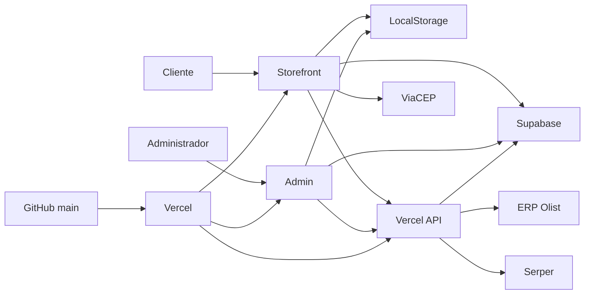
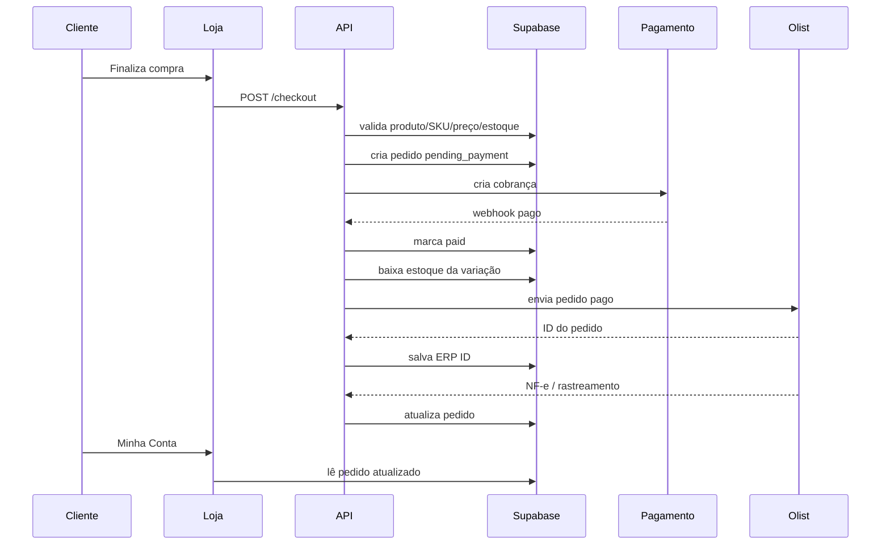

# Atletic Suplementos — Spec-to-Code

> Documento vivo de especificação funcional, arquitetura e mapeamento direto para o código.
>
> **Projeto:** Atletic Suplementos  
> **Repositório:** `AlissonMeesPersonal/atleticsuplementos`  
> **Produção:** `https://atleticsuplementos.vercel.app`  
> **Supabase:** projeto `swilmjgpivwynosvuuqm`  
> **Atualizado em:** 08/10/2026

---

## 1. Visão do produto

A Atletic Suplementos é uma plataforma de e-commerce de suplementos com:

- vitrine pública responsiva;
- catálogo por categorias;
- produto único com múltiplos sabores/variações;
- preço, imagem, SKU, código de barras e estoque independentes por sabor;
- sacola/carrinho;
- cupom;
- cálculo inicial por CEP;
- checkout progressivo;
- área individual do cliente;
- painel administrativo;
- biblioteca de imagens;
- controle de estoque;
- banners e parceiros;
- integração com Supabase;
- integração com ERP da Olist/Tiny;
- preparação para pedidos, NF-e, rastreamento e sincronização de estoque.

O objetivo é manter uma experiência simples para o cliente e uma gestão centralizada para a operação.

---

## 2. Princípios de negócio

### 2.1 Produto e variações

Um produto físico deve existir **uma única vez**.

Exemplo:

```text
Whey Protein DUX 900g
├── Chocolate
│   ├── SKU próprio
│   ├── imagem própria
│   ├── preço próprio
│   └── estoque próprio
├── Baunilha
└── Morango
```

Nunca duplicar o produto apenas porque o sabor mudou.

### 2.2 Estoque

O estoque pertence à **variação**, não ao produto pai.

Regra:

```text
Compra: 2 x Whey DUX 900g / Chocolate
→ baixa somente no estoque do SKU Chocolate
→ Baunilha e Morango não são alterados
```

A baixa definitiva de estoque deve ocorrer apenas após o evento de negócio definido para confirmação da venda, preferencialmente **pagamento aprovado**.

### 2.3 Olist

O ERP da Olist deve receber e devolver dados sempre por SKU da variação.

Fluxo alvo:

```text
Atletic
  → pagamento aprovado
  → pedido enviado à Olist
  → cliente + itens + SKU/sabor
  → estoque/fiscal
  → NF-e/rastreamento
  → retorno para Supabase
  → Minha Conta / Meus Pedidos
```

---

## 3. Stack atual

| Camada | Tecnologia |
|---|---|
| Frontend | HTML, CSS e JavaScript vanilla |
| Hospedagem | Vercel |
| Backend | Vercel Functions em `/api` |
| Banco/Auth | Supabase |
| Imagens | Assets GitHub + Supabase image library |
| Processamento de imagem | Sharp |
| ERP | Olist/Tiny API V2 Token |
| Busca de imagens | Serper |
| CEP | ViaCEP no frontend |
| Deploy | GitHub `main` → Vercel Production |

Dependências de runtime no `package.json`:

- `sharp`
- `archiver`

---

## 4. Arquitetura



### Estado atual importante

O projeto já possui um schema robusto no Supabase, mas **o CRUD principal de catálogo/admin ainda usa majoritariamente LocalStorage** por meio de:

```text
atletic.store.demo.v2
```

Supabase já é fonte real para:

- autenticação administrativa;
- autenticação do cliente;
- perfil do cliente;
- endereços do cliente;
- pedidos consultados em Minha Conta;
- biblioteca de imagens;
- configuração visual da home;
- dados/logs da integração ERP.

### Arquitetura alvo

Migrar o catálogo, produtos, variações, estoque, cupons, banners e pedidos para Supabase como fonte única de verdade.

```text
HOJE
Admin → LocalStorage → Loja

ALVO
Admin → Supabase → API/Realtime → Loja
                       ↓
                    Olist
```

---

## 5. Estrutura do repositório

### Frontend público

| Arquivo | Responsabilidade |
|---|---|
| `dist/index.html` | Estrutura da loja |
| `dist/styles.css` | Layout global da vitrine |
| `dist/app.js` | Catálogo, filtros, cards, sacola e navegação |
| `dist/carousel.js` | Hero/vitrine visual |
| `dist/store-data.js` | Modelo local de dados e catálogo |
| `dist/store-config.js` | Configuração pública do Supabase/endpoints |
| `dist/purchase-flow.js` | Produto, variações, CEP e checkout |
| `dist/purchase-flow.css` | UI do fluxo de compra |
| `dist/customer-account.js` | Conta, login, perfil, endereços, pedidos |
| `dist/customer-account.css` | UI da área do cliente |
| `dist/assets/` | Logos, imagens e produtos |

### Administrativo

| Arquivo | Responsabilidade |
|---|---|
| `dist/admin.html` | Estrutura do painel |
| `dist/admin.js` | CRUD, dashboard, estoque, imagens e integrações |
| `dist/admin.css` | UI do painel |
| `dist/admin-auth.js` | Gate de login e autorização |

### Backend

| Endpoint | Arquivo | Função |
|---|---|---|
| `/api/product-images` | `api/product-images.js` | Busca de imagens |
| `/api/image-library` | `api/image-library.js` | Biblioteca/importação de imagens |
| `/api/product-cutout` | `api/product-cutout.js` | Utilitário de transparência/cutout |
| `/api/site-visuals` | `api/site-visuals.js` | Hero e destaques da home |
| `/api/olist-erp` | `api/olist-erp.js` | Integração ERP Olist |

### Infra

| Arquivo | Função |
|---|---|
| `vercel.json` | Rewrites e políticas de cache |
| `package.json` | Dependências serverless |
| `SPEC_TO_CODE.md` | Este documento |

---

## 6. Módulos funcionais

### 6.1 Storefront

**Spec**

- exibir logo, busca, conta, tema e sacola;
- hero com 3 imagens;
- destaques por categoria;
- filtros;
- catálogo responsivo;
- cards visualmente grandes;
- mobile bottom navigation;
- dark/light mode.

**Code**

- `dist/index.html`
- `dist/styles.css`
- `dist/app.js`
- `dist/carousel.js`

**Status:** ✅ implementado.

---

## 7. Catálogo

### 7.1 Modelo local atual

`dist/store-data.js` expõe:

```js
window.AtleticStore = {
  KEY,
  uid,
  load,
  save,
  reset,
  catalog,
  stockBalance,
  activeBanners,
  initial
}
```

Chave de persistência:

```text
atletic.store.demo.v2
```

Coleções locais:

- brands
- categories
- products
- variants
- stock
- coupons
- banners
- customers
- orders

### 7.2 Produto

Campos funcionais:

- id
- name
- brandId
- categoryId
- description
- active
- featured
- images

### 7.3 Variação

Campos funcionais:

- id
- productId
- SKU
- barcode
- flavor
- size
- price
- comparePrice
- cost
- minStock
- image
- active

### 7.4 Regra visual

A função `catalog()` define:

```text
imagem da variação
    ↓ se não existir
imagem principal do produto
```

**Status:** ✅ implementado.

---

## 8. Cadastro de sabores/variações

### Spec

No Admin → Produtos:

1. cadastrar produto pai uma única vez;
2. adicionar quantos sabores forem necessários;
3. “Adicionar sabor” copia:
   - tamanho;
   - preço;
   - preço anterior;
   - custo;
   - estoque mínimo;
   - imagem;
4. sabor fica em branco;
5. SKU é gerado automaticamente com base no sabor;
6. código de barras fica independente;
7. estoque inicial não é duplicado automaticamente;
8. cada sabor é uma unidade de estoque.

### Code

Arquivo:

```text
dist/admin.js
```

Funções relevantes:

- `productVariants()`
- `variantImage()`
- `generatedVariantSku()`
- `variantRowHtml()`
- `renderVariantEditor()`
- `refreshVariantRow()`
- `updateAutoVariantSku()`
- `cloneVariantFromRow()`

**Status:** ✅ implementado no modelo local.

---

## 9. Estoque

### Spec

O saldo deve ser calculado por movimentação:

```text
saldo da variação = soma(delta)
```

Movimentações:

- entrada;
- saída;
- ajuste;
- estoque inicial;
- venda aprovada;
- devolução/cancelamento futuro.

### Code atual

`dist/store-data.js`:

- `stockBalance(data, variantId)`

`dist/admin.js`:

- módulo `stock`
- movimentação por variação/SKU.

### Regra

Nunca baixar estoque apenas ao:

- abrir produto;
- selecionar sabor;
- adicionar à sacola.

Baixa final somente após confirmação de negócio.

**Status atual:** 🟡 localStorage funcional; sincronização definitiva Supabase/Olist ainda pendente.

---

## 10. Imagens

### Fontes

1. `dist/assets/products/`
2. biblioteca `image_library` do Supabase;
3. busca externa via Serper;
4. importador do site legado;
5. utilitário `product-cutout`.

### Produto

- imagem principal;
- fallback para a principal;
- imagem específica por sabor;
- troca de imagem ao trocar variação.

### Admin

Permite:

- buscar na biblioteca;
- buscar na internet;
- importar catálogo legado;
- escolher imagem específica da variação.

### API

`api/image-library.js`:

- valida administrador;
- importa imagens;
- infere marca;
- infere categoria;
- grava biblioteca no Supabase.

**Status:** ✅ implementado.

---

## 11. Sacola

### Spec

- contador visível no topo;
- contador mobile;
- sacola flutuante no desktop;
- quantidade por item;
- remover item;
- total;
- cupom;
- CEP;
- finalizar compra.

### Persistência

```text
atletic.cart.v2
atletic.coupon.v2
```

### Code

`dist/app.js`

Responsabilidades:

- renderização da sacola;
- quantidade;
- total;
- cupom;
- badges;
- contador.

**Status:** ✅ implementado.

---

## 12. Fluxo de produto e compra

### Spec

Ao clicar no produto:

1. abrir modal;
2. exibir produto;
3. escolher sabor;
4. trocar imagem/estoque/preço/SKU conforme variação;
5. escolher quantidade;
6. adicionar à sacola;
7. ou Comprar agora.

### Code

`dist/purchase-flow.js`

Funções principais:

- `rawVariant()`
- `currentVariant()`
- `productFamily()`
- `flavorLabel()`
- `ensureProductTools()`
- `applyVariant()`
- `setQty()`
- `refreshProductTools()`

**Status:** ✅ implementado.

---

## 13. CEP

### Spec

Permitir que o cliente informe o CEP no carrinho e no checkout.

### Code

`dist/purchase-flow.js`:

- `formatCep()`
- `lookupCep()`

Fornecedor atual:

```text
ViaCEP
```

### Limite atual

ViaCEP resolve endereço, mas **não calcula valor de frete**.

**Status:** 🟡 endereço implementado; transportadora/frete real pendente.

---

## 14. Checkout

### Etapas

#### Etapa 1
- e-mail

#### Etapa 2
- nome
- WhatsApp
- CPF

#### Etapa 3
- CEP
- rua
- número
- complemento
- bairro
- cidade
- estado

#### Etapa 4
- resumo dos produtos
- subtotal
- desconto
- total
- endereço

### Persistência temporária

```text
atletic.checkout.draft.v1
```

### Code

`dist/purchase-flow.js`:

- `ensureCheckout()`
- `prefillCheckout()`
- `showStep()`
- `renderReview()`
- `openCheckout()`
- `closeCheckout()`

### Estado atual

O botão de pagamento ainda é uma etapa preparatória.

**Status:** 🟡 checkout de dados pronto; pagamento real pendente.

---

## 15. Minha Conta

### Menu

- Minha Conta
- Meus Pedidos
- Endereços
- Favoritos
- Sair

### Autenticação

Supabase Auth independente do Admin.

LocalStorage:

```text
atletic.customer.access_token
atletic.customer.refresh_token
atletic.customer.user
```

### Perfil

Tabela:

```text
customers
```

Dados:

- nome;
- e-mail;
- telefone;
- CPF;
- nascimento;
- marketing.

### Endereços

Tabela:

```text
customer_addresses
```

### Pedidos

Tabela:

```text
orders
```

### Code

`dist/customer-account.js`:

- `currentUser()`
- `ensureProfile()`
- `fetchProfile()`
- `fetchAddresses()`
- `fetchOrders()`
- `authView()`
- `profileForm()`
- `ordersView()`
- `addressesView()`
- `renderDashboard()`

### Favoritos

UI existe, mas vínculo real de favoritos ainda não está implementado.

**Status:** 🟡 conta/perfil/endereços/pedidos prontos; favoritos pendentes.

---

## 16. Admin

### Módulos

`dist/admin.js`:

```text
Dashboard
Produtos
Categorias
Marcas
Estoque
Clientes
Pedidos
Cupons
Banners / Parceiros
Vitrine do site
Biblioteca de imagens
Integrações
Configurações
```

### Autenticação

`dist/admin-auth.js`:

- Supabase Auth;
- sessão;
- refresh token;
- consulta `admin_users`;
- bloqueio de usuário não autorizado.

### Papéis usados

- admin
- manager
- catalog

### Sessão Admin

```text
atletic.supabase.access_token
atletic.supabase.refresh_token
atletic.supabase.user
```

**Status:** ✅ gate de autenticação e painel implementados.

---

## 17. Banners / Parceiros

### Spec

Permitir:

- campanha institucional;
- parceiro;
- imagem desktop;
- imagem mobile;
- CTA;
- link;
- WhatsApp;
- posição;
- período;
- ativo/inativo.

### Code

- `dist/store-data.js`
- `dist/admin.js`
- frontend/banner/carousel.

**Status:** ✅ modelo local implementado.

---

## 18. Vitrine do site

### Configuração

Admin escolhe:

- 3 imagens do hero;
- 1 imagem para Proteínas;
- 1 para Creatinas;
- 1 para Pré-treinos;
- 1 para Vitaminas;
- 1 para Acessórios.

### Backend

```text
/api/site-visuals
```

### Supabase

```text
store_settings
key = homepage_visuals
```

### Segurança

- GET público;
- POST somente admin autorizado.

**Status:** ✅ Supabase como fonte real.

---

## 19. ERP da Olist

### Variável secreta

```text
OLIST_ERP_TOKEN
```

A credencial fica na Vercel e não é enviada ao navegador.

### Backend

```text
api/olist-erp.js
```

### Funções

- `validateAdmin()`
- `tinyPost()`
- `testConnection()`
- `searchProductBySku()`
- `matchCatalog()`
- `groupCatalogItems()`
- `productIncludePayload()`
- `createProductGroup()`
- `createMissingCatalog()`
- `buildOrder()`
- `sendOrder()`

### Fluxos atuais

#### Teste de conexão

```text
Admin
→ /api/olist-erp action=test
→ Token API
→ valida conta
→ grava healthcheck
```

#### Mapear catálogo

```text
SKU Atletic
→ produtos.pesquisa.php
→ SKU encontrado?
   ├── sim → grava mapping
   └── não → not_found
```

#### Cadastrar ausentes

```text
Produtos locais
→ agrupar por produto pai
→ conferir todos os SKUs
→ evitar duplicidade
→ produto.incluir.php
→ variações Sabor/Tamanho
→ gravar IDs no Supabase
```

### Regra fiscal

Antes de cadastrar no ERP, selecionar origem fiscal:

- 0 Nacional
- 1 a 8 conforme origem do produto

A aplicação não deve adivinhar origem fiscal real.

### Pedido

A função de envio existe no backend, mas ainda não está automaticamente conectada ao evento “pagamento aprovado”.

**Status:** 🟡 conexão, mapeamento e cadastro preparados; automação pós-pagamento, NF-e e estoque bidirecional pendentes.

---

## 20. Supabase — tabelas atuais

### Acesso/admin

- `admin_users`

### Catálogo

- `brands`
- `categories`
- `products`
- `product_variants`
- `product_images`
- `product_image_candidates`
- `image_library`

### Estoque

- `inventory`
- `inventory_movements`

### Cliente

- `customers`
- `customer_addresses`

### Carrinho

- `carts`
- `cart_items`

### Pedido

- `orders`
- `order_items`

### Cupom

- `coupons`
- `coupon_products`
- `coupon_categories`
- `coupon_redemptions`

### Marketing

- `banners`
- `partners`
- `store_settings`

### ERP

- `erp_integrations`
- `erp_product_mappings`
- `erp_sync_logs`

---

## 21. RLS e segurança

Políticas já presentes incluem:

- admin lê próprio perfil;
- catálogo ativo com leitura pública;
- cliente gerencia próprio carrinho;
- cliente gerencia próprios endereços;
- cliente lê/edita próprio perfil;
- cliente lê próprios pedidos;
- cliente lê itens dos próprios pedidos;
- admins gerenciam integração ERP;
- admins/catálogo gerenciam mapeamentos ERP;
- biblioteca de imagens protegida;
- homepage visuals público para leitura e admin para gravação.

### Regras obrigatórias

1. Nunca expor `OLIST_ERP_TOKEN` no frontend.
2. Nunca expor `SERPER_API_KEY`.
3. Não usar Service Role no browser.
4. Operações administrativas sensíveis precisam validar `admin_users`.
5. Estoque, pagamento e pedidos finais devem ser confirmados no servidor.
6. Não confiar no preço enviado pelo browser para criar pedido pago.

---

## 22. Variáveis de ambiente

### Vercel

```text
SUPABASE_URL
SUPABASE_PUBLISHABLE_KEY
SERPER_API_KEY
OLIST_ERP_TOKEN
```

### Regra

- `SUPABASE_PUBLISHABLE_KEY`: pode ser usada no cliente;
- tokens privados: apenas Vercel Functions.

---

## 23. Cache e deploy

`vercel.json`:

### Rotas

- `/` → `dist/index.html`
- `/admin` → `dist/admin.html`
- arquivos estáticos → `dist/*`

### Cache

Home:

```text
Cache-Control: no-store
CDN-Cache-Control: no-store
```

JS/CSS:

```text
no-cache, max-age=0, must-revalidate
```

Além disso, o HTML usa parâmetros `?v=...` para cache busting.

**Objetivo:** evitar que mobile/Safari continue carregando versões antigas.

---

## 24. Spec-to-Code — matriz principal

| Requisito | Código | Dados | Status |
|---|---|---|---|
| Catálogo responsivo | `app.js`, `styles.css` | LocalStorage | ✅ |
| Produto único com sabores | `store-data.js`, `admin.js` | LocalStorage | ✅ |
| Imagem por sabor | `store-data.js`, `purchase-flow.js` | LocalStorage/assets | ✅ |
| SKU por sabor | `admin.js` | variants | ✅ |
| Estoque por sabor | `store-data.js`, `admin.js` | stock | ✅ |
| Sacola com contador | `app.js` | `atletic.cart.v2` | ✅ |
| Quantidade | `app.js`, `purchase-flow.js` | LocalStorage | ✅ |
| Cupom | `app.js` | LocalStorage | ✅ |
| CEP | `purchase-flow.js` | ViaCEP/draft | ✅ |
| Checkout em etapas | `purchase-flow.js` | draft | ✅ |
| Pagamento | — | — | ⬜ |
| Login cliente | `customer-account.js` | Supabase Auth | ✅ |
| Perfil | `customer-account.js` | customers | ✅ |
| Endereços | `customer-account.js` | customer_addresses | ✅ |
| Meus Pedidos | `customer-account.js` | orders | ✅ leitura |
| Favoritos | UI | — | ⬜ |
| Login Admin | `admin-auth.js` | Auth/admin_users | ✅ |
| Biblioteca de imagens | `admin.js`, API | image_library | ✅ |
| Hero/destaques | `carousel.js`, site-visuals | store_settings | ✅ |
| ERP Olist teste | `olist-erp.js` | erp_integrations | ✅ |
| Olist mapear SKU | `olist-erp.js` | erp_product_mappings | ✅ |
| Olist criar produto/variação | `olist-erp.js` | mappings/logs | ✅ |
| Olist enviar pedido | backend pronto | orders | 🟡 |
| NF-e Olist → Atletic | schema pronto | orders | ⬜ |
| Rastreio Olist → Conta | schema preparado | orders | ⬜ |
| Sync estoque Olist | backend futuro | inventory | ⬜ |
| Catálogo real Supabase | schema pronto | products/variants | ⬜ migração |
| Admin CRUD Supabase | schema pronto | várias | ⬜ migração |

---

## 25. Débito técnico atual

### Prioridade 1 — Fonte única de dados

O maior ponto técnico atual:

> Admin e catálogo ainda dependem de LocalStorage.

Risco:

- cadastro feito em um navegador não é automaticamente compartilhado com outro;
- limpeza do navegador pode apagar cadastros locais;
- Olist recebe dados do catálogo local, não necessariamente do banco.

Correção alvo:

```text
Admin CRUD
→ Vercel API / Supabase
→ products/product_variants/inventory
→ Storefront
```

### Prioridade 2 — Pedido real

Checkout ainda não gera um pedido server-side definitivo.

Necessário:

1. validar carrinho no servidor;
2. buscar preço atual;
3. validar estoque;
4. validar cupom;
5. calcular frete;
6. criar pedido `pending_payment`;
7. criar pagamento;
8. processar webhook;
9. marcar como pago;
10. baixar estoque;
11. enviar para Olist.

### Prioridade 3 — Estoque

Migrar movimentações locais para:

- `inventory`
- `inventory_movements`

Toda baixa precisa ser idempotente.

---

## 26. Arquitetura alvo de pedido



---

## 27. Regras do pedido

### Totais

Nunca aceitar como confiável:

```text
price
discount
shipping
total
```

vindos do browser.

O servidor deve recalcular.

### Estoque

Operação precisa verificar:

```text
stock >= quantity
```

antes de confirmar.

### Idempotência

Webhook de pagamento pode ser recebido mais de uma vez.

A baixa de estoque e envio à Olist não podem duplicar.

Sugestão:

```text
payment_event_id UNIQUE
erp_sync_status
inventory_movement reference/order_id UNIQUE
```

---

## 28. Estados sugeridos do pedido

```text
draft
pending_payment
paid
processing
sent_to_erp
invoice_pending
invoice_issued
ready_to_ship
shipped
delivered
cancelled
refunded
```

Pagamento:

```text
pending
approved
failed
cancelled
refunded
```

ERP:

```text
pending
syncing
synced
error
```

---

## 29. Critérios de aceite — catálogo

### AC-CAT-01
Um produto com 5 sabores aparece uma vez no catálogo.

### AC-CAT-02
Ao abrir o produto, os 5 sabores aparecem.

### AC-CAT-03
Ao trocar o sabor, atualizam:

- imagem;
- preço;
- SKU;
- estoque;
- disponibilidade.

### AC-CAT-04
Adicionar Chocolate ao carrinho não troca por Baunilha.

---

## 30. Critérios de aceite — estoque

### AC-STK-01
Venda de 2 Chocolate:

```text
Chocolate: -2
Baunilha: 0
Morango: 0
```

### AC-STK-02
Adicionar ao carrinho não baixa saldo.

### AC-STK-03
Pagamento rejeitado não baixa saldo definitivo.

### AC-STK-04
Webhook duplicado não baixa duas vezes.

---

## 31. Critérios de aceite — cliente

### AC-ACC-01
Cada cliente só lê o próprio perfil.

### AC-ACC-02
Cada cliente só lê os próprios pedidos.

### AC-ACC-03
Cada cliente só gerencia os próprios endereços.

### AC-ACC-04
Logout remove sessão local.

---

## 32. Critérios de aceite — Olist

### AC-ERP-01
Token nunca aparece no browser.

### AC-ERP-02
Teste de conexão identifica conta válida.

### AC-ERP-03
SKU existente é mapeado sem duplicar produto.

### AC-ERP-04
SKU inexistente retorna `not_found`, não erro técnico.

### AC-ERP-05
Produto novo com sabores é cadastrado como produto com variações.

### AC-ERP-06
Cada sabor conserva SKU próprio.

### AC-ERP-07
Pedido pago é enviado uma única vez.

---

## 33. Próximas etapas recomendadas

### Fase 1 — Persistência real
- migrar Produtos;
- migrar Variações;
- migrar Marcas/Categorias;
- migrar Estoque;
- migrar Cupons/Banners;
- substituir `atletic.store.demo.v2`.

### Fase 2 — Checkout real
- criar endpoint server-side;
- criar pedido;
- integrar frete;
- integrar pagamento;
- webhook de aprovação.

### Fase 3 — Olist
- envio automático do pedido aprovado;
- retorno do ID;
- NF-e;
- rastreamento;
- sincronização de estoque.

### Fase 4 — Conta
- favoritos reais;
- histórico detalhado;
- timeline de pedido;
- nota fiscal;
- rastreamento.

### Fase 5 — Operação
- dashboard financeiro;
- margem por produto;
- curva ABC;
- estoque baixo;
- alertas;
- auditoria de alterações.

---

## 34. Definição de “produção pronta”

O projeto só deve ser considerado e-commerce transacional completo quando:

- [ ] catálogo estiver no Supabase;
- [ ] estoque real estiver no Supabase;
- [ ] checkout criar pedido server-side;
- [ ] frete estiver integrado;
- [ ] pagamento estiver integrado;
- [ ] webhook estiver validado;
- [ ] estoque baixar apenas após pagamento;
- [ ] Olist receber pedido automaticamente;
- [ ] NF-e retornar para o pedido;
- [ ] Minha Conta mostrar status real;
- [ ] operação não depender de LocalStorage para dados administrativos.

---

## 35. Resumo executivo

### Já funcional

- loja responsiva;
- catálogo;
- produtos;
- sabores/variações;
- imagens por sabor;
- SKU automático;
- estoque por variação no modelo local;
- sacola;
- cupom;
- CEP;
- checkout visual;
- área do cliente;
- login admin;
- biblioteca de imagens;
- vitrine;
- integração Olist: autenticação, busca de SKU e cadastro de produtos/variações;
- RLS para áreas relevantes.

### Próximo salto técnico

> Remover o LocalStorage como banco principal e tornar Supabase + backend a fonte única para catálogo, estoque e pedidos.

Essa mudança transforma o projeto atual de uma plataforma funcional em browser em uma arquitetura de e-commerce consistente, multiusuário e pronta para pagamento, estoque e ERP em produção.
